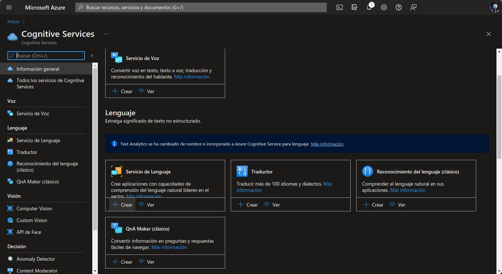
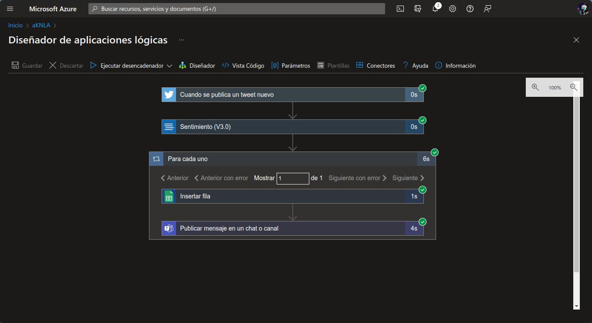

# Aplicacion de Azure Logic Apps para leer twits.

El objetivo es crear una aplicación que permita ánalizar twits, mostrarlos en MS Teams y guardarlos en una hoja de cálculo.

Para ello es necesario contar con:

- Una cuenta de Microsoft Azure y una suscripción a Azure.
- Una cuenta de Microsoft Teams.
- Una cuenta de Microsoft Office o Google Drive.
- Una cuenta de Twitter.

En este caso usamos una cuentad de Google Drive para crear una hoja de cálculo en la que se guardarán los twits y una cuenta de Microsoft Teams para mostrar los twits en MS Teams en un nuevo canal.

# Índice
- [Microsoft Azure](#microsoft-azure)
    - [Cognitive Services](#cognitive-services)
    - [Logic Apps](#logic-apps)
        - [Cuando se crea un twit](#Cuando-se-crea-un-twit)
        - [Sentimiento](#sentimiento)
        - [Para cada uno](#para-cada-uno)
            - [Hoja de cálculo](#hoja-de-calculo)
            - [MS Teams](#ms-teams)

# Microsoft Azure
Desde el [portal de Microsoft Azure](https://portal.azure.com) usaremos dos recursos:

## Cognitive Services
Dentro del portal de Azure, creamos un recurso de Cognitive Services llenado el formulario de **Aspectos básicos** (Suscription, Region, Resource Group, etc), seguido del apartado de **Revisa y crear**.


Una vez creado el recurso, creamos un **Servicio de Lenguaje** que utilizaremos más adelante.


## Logic Apps
Dentro del portal de Azure, creamos un recurso de Logic Apps llenado el formulario de **Aspectos básicos** (Suscription, Region, Resource Group, etc) con el servicio de **Log Analytics** desactivado y un plan de **Consumo**. Despues de llenar el formulario, seguimos con el apartado de **Revisa y crear**.


Despues de crear el recurso, podemos acceder al **Diseñador de aplicaciones lógicas**. En el apartado de **Plantillas**, seleccionamos una ```Aplicación lógica en blanco```.


En esta sección crearemos tres pasos:

### Cuando se publica un twit
Buscamos en **Twitter** la opción de ```Cuando se publica un twit``` y llenamos el campo de **Texto de búsqueda** seguido de un inicio de seción.


### Sentimiento
Buscamos en **Azure cognitive services** la opción de ```Sentimiento```.


Para llenal la información una de las claves del **Servicio de Lenguaje** y la información de la opción de **Extremo** de este.


### Para cada uno
#### Hoja de cálculo
En esta sección, definimos que se realizará con cada uno de los twits. Para la primer acción, seleccionamos la opción **Insertar fila** de Google Sheets y lo llenamos con la información correspondiente a la hoja de cálculo de Google Drive y la información del twit.


#### MS Teams
En MS Teams creamos un nuevo grupo desde la opción **Unirse a un equipo o crear uno**. 


En la soccion de **Para cada uno** agregamos la accion **Publicar mensaje un un chat o canal** de Teams y lo llenamos con la información del canal que creamos.

Para terminar guardamos el proyecto y lo ejecutamos. 

